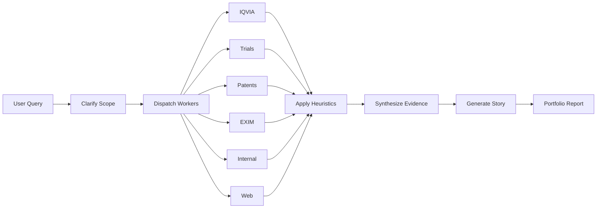
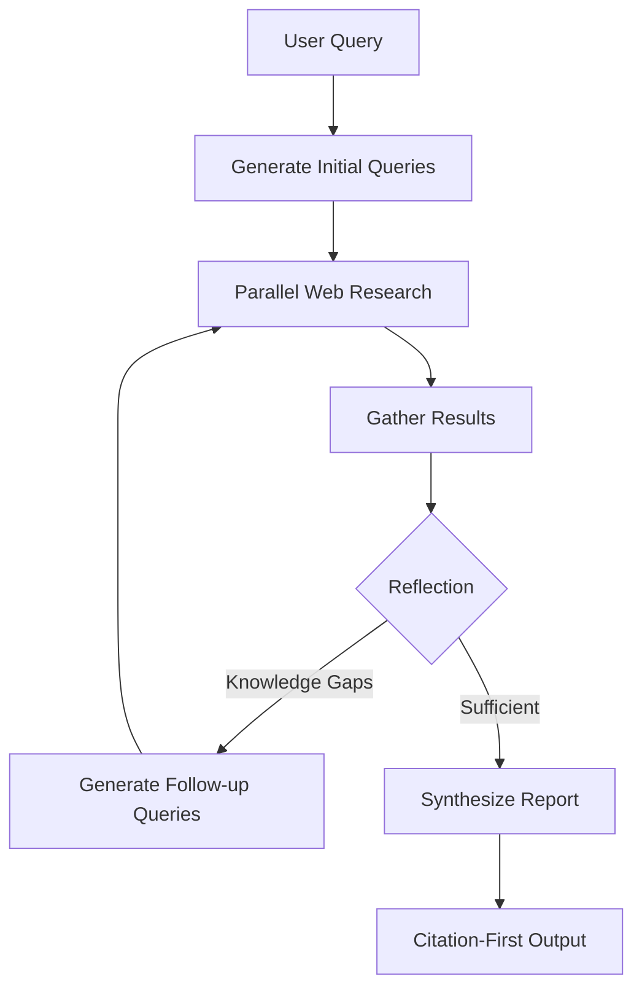

# AI Agents

Pramana.ai includes five specialized AI agents, each optimized for different research workflows. All agents are powered by Groq's LLaMA models and built using LangGraph.

## Table of Contents

- [Portfolio Strategist](#portfolio-strategist)
- [Deep Researcher](#deep-researcher)
- [Chat Assistant](#chat-assistant)
- [Math Solver](#math-solver)
- [MCP Agent](#mcp-agent)

---

## Portfolio Strategist

**AI-powered pharmaceutical innovation discovery with multi-source evidence synthesis**

The Portfolio Strategist is the default agent for biomedical opportunity analysis. It orchestrates parallel research across six data sources, applies sophisticated decision heuristics, and generates comprehensive opportunity reports.

### Workflow



### Data Sources

#### 1. IQVIA Connector
**Market intelligence and competitive landscape**

- Market size and CAGR projections
- Competitive concentration (HHI index)
- Top player market shares
- Unmet need scoring
- Fragmentation analysis

#### 2. Clinical Trials
**Live research activity via ClinicalTrials.gov API**

- Active and recruiting trials
- Sponsor classification (Industry, Academic, NIH)
- Phase distribution (Phase 1-4)
- Enrollment statistics
- Geographic distribution

#### 3. Patent Search
**IP landscape analysis**

- Patent expiration timelines
- Freedom-to-operate (FTO) status
- Claim breadth analysis
- Jurisdictional coverage
- Blocking patents identification

#### 4. EXIM Data
**Import/export intelligence**

- Dependency scoring
- Local manufacturing opportunities
- Import volume trends
- Cost competitiveness
- Supply chain insights

#### 5. Internal Research
**Proprietary data and institutional knowledge**

- Past project outcomes
- Internal expertise mapping
- Resource availability
- Strategic alignment

#### 6. Web Research
**General market intelligence**

- News and trends
- KOL opinions
- Market access insights
- Regulatory developments

### Decision Heuristics

The Portfolio Strategist applies seven sophisticated decision heuristics to evaluate opportunities:

#### HEURISTIC 1: Market Whitespace
**Identifies unmet medical needs with limited competition**

```python
# Scoring Logic
if unmet_need > 0.7 and active_trials < 5:
    signals.append("HIGH_WHITESPACE")
    opportunity += 20
elif unmet_need > 0.5 and active_trials < 10:
    signals.append("MODERATE_WHITESPACE")
    opportunity += 10
```

**Impact:**
- High Whitespace: +20 opportunity points
- Moderate Whitespace: +10 opportunity points

**Example:** Metformin for anti-aging in the US shows HIGH_WHITESPACE with unmet need score of 0.85 and only 3 active trials.

---

#### HEURISTIC 2: Patent Window
**Identifies opportunities with expiring key patents**

```python
# Scoring Logic
expiring_soon = [patent for patent in patents if years_to_expiry <= 3]
if expiring_soon:
    signals.append("PATENT_WINDOW_OPEN")
    opportunity += 15
    innovation += 10
```

**Impact:**
- Opportunity: +15 points
- Innovation: +10 points

**Example:** Major diabetes drugs with patents expiring 2025-2027 create PATENT_WINDOW_OPEN opportunities.

---

#### HEURISTIC 3: Market Fragmentation
**Evaluates competitive intensity**

```python
# Scoring Logic
if total_players > 20 and top_5_share > 70:
    signals.append("CROWDED_MARKET")
    opportunity -= 15
    risk += 10
elif fragmentation_index == "HIGH":
    signals.append("FRAGMENTED_MARKET")
    opportunity += 10
```

**Impact:**
- Crowded Market: -15 opportunity, +10 risk
- Fragmented Market: +10 opportunity

**Metrics Used:**
- Total player count
- Top 5 concentration ratio
- Fragmentation index (HIGH/MEDIUM/LOW)

---

#### HEURISTIC 4: Import Dependency
**Identifies local manufacturing opportunities**

```python
# Scoring Logic
if import_dependency > 0.7:
    signals.append("HIGH_IMPORT_DEPENDENCY")
    risk += 10
    if "LOCAL_MANUFACTURING_OPPORTUNITY" in flags:
        signals.append("LOCAL_MFG_OPPORTUNITY")
        opportunity += 8
```

**Impact:**
- High Dependency: +10 risk
- Local Mfg Opportunity: +8 opportunity

**Example:** India's respiratory drug market shows HIGH_IMPORT_DEPENDENCY (0.82) but strong LOCAL_MFG_OPPORTUNITY.

---

#### HEURISTIC 5: Big Pharma Activity
**Detects major player presence in late-stage trials**

```python
# Scoring Logic
big_pharma_late_stage = [
    trial for trial in trials
    if sponsor_class == "INDUSTRY" and phase in ["PHASE3", "PHASE4"]
]
if big_pharma_late_stage:
    signals.append("BIG_PHARMA_ACTIVE")
    opportunity -= 10
    risk += 5
```

**Impact:**
- Opportunity: -10 points
- Risk: +5 points

**Rationale:** Late-stage industry trials indicate crowded competitive space.

---

#### HEURISTIC 6: Market Growth
**Evaluates market trajectory**

```python
# Scoring Logic
if cagr_5yr > 8:
    signals.append("HIGH_GROWTH_MARKET")
    opportunity += 12
elif cagr_5yr > 5:
    signals.append("MODERATE_GROWTH")
    opportunity += 5
```

**Impact:**
- High Growth (>8% CAGR): +12 opportunity
- Moderate Growth (5-8% CAGR): +5 opportunity

---

#### HEURISTIC 7: Freedom to Operate
**Identifies IP blocking risks**

```python
# Scoring Logic
fto_blocked = [patent for patent in patents if fto_status == "BLOCKED"]
fto_warnings = [patent for patent in patents if fto_status == "WARNING"]

if fto_blocked:
    signals.append("FTO_BLOCKED")
    risk += 20
    opportunity -= 15
elif fto_warnings:
    signals.append("FTO_WARNING")
    risk += 10
```

**Impact:**
- FTO Blocked: +20 risk, -15 opportunity
- FTO Warning: +10 risk

---

### Output Format

The Portfolio Strategist generates a comprehensive report with:

1. **Executive Summary** — One-paragraph opportunity synthesis
2. **Opportunity Score** — 0-100 scale with breakdown
3. **Risk Score** — 0-100 scale with breakdown
4. **Innovation Score** — 0-100 scale with breakdown
5. **Signal Summary** — List of triggered heuristic signals
6. **Evidence Base** — Citations and data sources
7. **Strategic Recommendation** — Go/No-Go with rationale

### Demo Scenarios

| Molecule/Therapy | Region | Opportunity Score | Key Signals |
|------------------|--------|-------------------|-------------|
| Metformin (Anti-Aging) | United States | 87/100 | HIGH_WHITESPACE, PATENT_WINDOW_OPEN, HIGH_GROWTH_MARKET |
| COPD Respiratory Therapy | India | 85/100 | HIGH_WHITESPACE, FRAGMENTED_MARKET, LOCAL_MFG_OPPORTUNITY |
| Oncology Checkpoint Inhibitor | Europe | 42/100 | CROWDED_MARKET, BIG_PHARMA_ACTIVE, FTO_WARNING |

### Configuration

The Portfolio Strategist is configured in [backend/src/agent/portfolio/orchestrator.py](../backend/src/agent/portfolio/orchestrator.py).

**Key Parameters:**
- `max_parallel_workers`: 6 (default)
- `timeout_per_worker`: 30 seconds
- `heuristic_weight_profiles`: Customizable scoring weights

### Mock Data Note

> ⚠️ **Important:** Current connectors use mock data for demonstration. In production, replace with real APIs:
> - IQVIA: Requires enterprise license
> - Patents: Use USPTO/EPO APIs or Google Patents
> - EXIM: Connect to trade databases (e.g., UN Comtrade)
> - Internal: Integrate with your data warehouse

---

## Deep Researcher

**Advanced web research with iterative query refinement and citation tracking**

The Deep Researcher performs comprehensive web research using SerpAPI, with intelligent query generation and reflection loops to ensure thorough coverage.

### Workflow



### Features

#### 1. Intelligent Query Generation
Uses Groq LLMs to generate optimized search queries:

```python
# Example generated queries for "CRISPR gene therapy safety"
[
    "CRISPR gene therapy clinical trial safety results 2024",
    "off-target effects CRISPR Cas9 human trials",
    "FDA CRISPR therapy adverse events reporting"
]
```

#### 2. Reflection Loop
After each research iteration, the agent reflects on:
- Information completeness
- Knowledge gaps
- Source quality
- Need for follow-up queries

**Max Iterations:** 2 (configurable)

#### 3. Citation Management
Every claim is backed by:
- Source URL
- Publication date
- Relevance score
- Snippet extraction

### Configuration Options

| Parameter | Default | Description |
|-----------|---------|-------------|
| `initial_search_query_count` | 3 | Number of initial queries to generate |
| `max_research_loops` | 2 | Maximum refinement iterations |
| `search_result_limit` | 10 | Results per query |
| `reasoning_model` | llama-3.3-70b-versatile | Model for query generation and reflection |
| `response_model` | llama-3.3-70b-versatile | Model for final synthesis |

**Edit Configuration:**
Modify [backend/src/agent/deep_researcher.py](../backend/src/agent/deep_researcher.py) or pass configuration via LangGraph Studio.

### Output Format

```markdown
# Research Report: [Topic]

## Executive Summary
[One-paragraph overview]

## Key Findings

### Finding 1: [Title]
[Detailed explanation]

**Sources:**
1. [Source Title](URL) — [Date]
2. [Source Title](URL) — [Date]

### Finding 2: [Title]
[Detailed explanation]

**Sources:**
...

## Sources Consulted
- [Complete bibliography with URLs]
```

### Best Practices

1. **Be Specific** — Better: "CAR-T therapy for pediatric ALL safety data 2023-2024" vs "cancer treatment"
2. **Set Context** — Mention year, geography, or specific aspects
3. **Iterate** — Review first output and ask follow-up questions
4. **Verify** — Always check source citations for accuracy

### API Requirements

**Required:** `SERPAPI_API_KEY` in `.env`

```bash
# Get your key from https://serpapi.com/
SERPAPI_API_KEY=your_serpapi_api_key_here
```

**Alternative:** Set `MCP_BRAVE_SEARCH_ENABLED=true` and use Brave Search MCP server.

---

## Chat Assistant

**General-purpose conversational AI with context awareness**

A friendly, helpful chatbot for casual conversation and quick Q&A.

### Features

- **Conversational Memory** — Maintains last 10 messages for context
- **Fast Responses** — Powered by Groq's optimized inference
- **Friendly Tone** — Natural, approachable communication style
- **No Tool Calling** — Pure conversation without web search or calculations

### Best For

- Quick questions and clarifications
- General knowledge queries
- Friendly conversation
- Explaining concepts
- Brainstorming ideas

### Configuration

**Model:** `llama-3.3-70b-versatile` (default)

**System Prompt:** Friendly, helpful assistant persona  
**Message History:** Last 10 messages  
**Streaming:** Enabled by default

**Edit Configuration:**  
[backend/src/agent/chatbot_graph.py](../backend/src/agent/chatbot_graph.py)

### Example Interactions

**User:** "Explain LangGraph in simple terms"  
**Assistant:** "LangGraph is a framework for building AI agents as graphs. Think of it like a flowchart where each box is an AI task, and arrows show how information flows. It makes complex AI workflows easier to build, test, and understand!"

**User:** "What's the difference between supervised and unsupervised learning?"  
**Assistant:** [Provides clear explanation with examples]

---

## Math Solver

**Safe mathematical expression evaluation and problem-solving**

A specialized agent for mathematical calculations with sandboxed execution.

### Capabilities

#### Basic Arithmetic
```python
"2 + 3 * 4"           # → 14
"10 / 2 - 3"          # → 2.0
"2 ** 8"              # → 256
```

#### Mathematical Functions
```python
"sqrt(16)"            # → 4.0
"sin(pi/2)"           # → 1.0
"cos(0)"              # → 1.0
"tan(pi/4)"           # → 1.0
"log(e)"              # → 1.0
"exp(1)"              # → 2.718...
```

#### Complex Expressions
```python
"sqrt(sin(pi/4)**2 + cos(pi/4)**2)"   # → 1.0
"2 * pi * 5"                           # → 31.415...
```

### Safety Features

1. **Sandboxed Execution** — Isolated evaluation environment
2. **Whitelist Functions** — Only safe math operations allowed
3. **No File System Access** — Cannot read/write files
4. **No Network Access** — Cannot make external requests
5. **No Code Execution** — Only mathematical expressions

**Allowed Functions:**
- Arithmetic: `+`, `-`, `*`, `/`, `**`, `//`, `%`
- Math: `sqrt`, `sin`, `cos`, `tan`, `log`, `exp`, `log10`, `factorial`
- Constants: `pi`, `e`

### Configuration

**Tool:** `calculator` from [backend/src/tools/calculator.py](../backend/src/tools/calculator.py)  
**Model:** `llama-3.3-70b-versatile`  
**Max Expression Length:** 500 characters

### Example Session

```
User: "What's the square root of 144?"
Math Agent: Let me calculate that. [uses calculator]
Answer: 12.0

User: "Calculate sin(30 degrees)"
Math Agent: Converting to radians... [uses calculator]
sin(30°) = sin(pi/6) ≈ 0.5

User: "If I invest $1000 at 5% annual interest for 10 years, how much will I have?"
Math Agent: Using compound interest formula A = P(1 + r)^t
[uses calculator]
$1000 * (1.05)^10 ≈ $1,628.89
```

---

## MCP Agent

**Model Context Protocol integration for extensible tool ecosystem**

The MCP Agent connects to external MCP servers, enabling file operations, web search, and other tool integrations.

### What is MCP?

[Model Context Protocol](https://modelcontextprotocol.io/) is an open standard for connecting AI agents to external tools and data sources. Think of it as a universal adapter for AI tools.

### Supported MCP Servers

#### 1. Filesystem MCP Server
**File and directory operations**

**Capabilities:**
- Read file contents
- Write files
- List directories
- Create/delete files
- Sandboxed access to specified paths

**Configuration:**
```bash
# backend/.env
MCP_FILESYSTEM_ENABLED=true
MCP_FILESYSTEM_PATH=/app/workspace  # Sandbox root
```

**Example Usage:**
```
User: "Read the contents of project_notes.txt"
MCP Agent: [reads file] Here are the contents...

User: "Create a new file called summary.md with this content: ..."
MCP Agent: [creates file] File created successfully at /app/workspace/summary.md
```

#### 2. Brave Search MCP Server
**Web search alternative to SerpAPI**

**Capabilities:**
- Web search
- News search
- Result processing
- Citation extraction

**Configuration:**
```bash
# backend/.env
MCP_BRAVE_SEARCH_ENABLED=true
BRAVE_API_KEY=your_brave_api_key_here
```

**Get API Key:** https://brave.com/search/api/

### Adding Custom MCP Servers

1. **Install the MCP server:**
   ```bash
   npm install -g @modelcontextprotocol/server-[name]
   ```

2. **Configure in [backend/src/config/mcp_config.py](../backend/src/config/mcp_config.py):**
   ```python
   MCP_SERVERS = [
       {
           "name": "my_custom_server",
           "command": "npx",
           "args": ["-y", "@modelcontextprotocol/server-my-custom"],
           "env": {"API_KEY": os.getenv("MY_CUSTOM_API_KEY")}
       }
   ]
   ```

3. **Restart the backend** — MCP servers load at startup

### Architecture

```
┌─────────────────────────────────────────────────┐
│              MCP Agent (LangGraph)              │
└────────────────────┬────────────────────────────┘
                     │
        ┌────────────┴────────────┐
        │  MCP Loader (SSE/Stdio) │
        └────────────┬────────────┘
                     │
     ┌───────────────┼───────────────┐
     │               │               │
┌────▼────┐    ┌────▼────┐    ┌────▼────┐
│Filesystem│    │  Brave  │    │ Custom  │
│ Server   │    │ Search  │    │ Server  │
└──────────┘    └─────────┘    └─────────┘
```

### Best Practices

1. **Sandbox Paths** — Always use sandboxed directories for filesystem access
2. **Error Handling** — MCP agents handle server failures gracefully
3. **Parallel Init** — Multiple MCP servers load in parallel at startup
4. **Resource Limits** — Configure timeouts for long-running operations

### Troubleshooting

**MCP server not loading:**
- Check server is installed: `npm list -g | grep mcp`
- Verify environment variables in `.env`
- Check logs: Backend will log MCP initialization errors

**Tool not available:**
- Confirm server is enabled in config
- Restart backend after config changes
- Check MCP server health endpoint

---

## Agent Selection Guide

| Use Case | Recommended Agent | Why |
|----------|-------------------|-----|
| Drug opportunity analysis | Portfolio Strategist | Multi-source synthesis + heuristics |
| Research deep dive | Deep Researcher | Iterative web research + citations |
| Quick Q&A | Chat Assistant | Fast, conversational |
| Calculations | Math Solver | Safe expression evaluation |
| File operations | MCP Agent | Filesystem access via MCP |
| Web search (no SerpAPI) | MCP Agent | Brave Search MCP server |

---

## Technical Implementation

All agents are built using:

- **LangGraph** — Graph-based agent orchestration
- **LangChain** — LLM framework and tool integration
- **Groq** — Fast inference with LLaMA models
- **State Management** — Persistent state across agent steps
- **Streaming** — Real-time output via Server-Sent Events (SSE)

**Agent Registration:** [backend/langgraph.json](../backend/langgraph.json)

```json
{
  "graphs": {
    "portfolio_strategist": "./src/agent/portfolio/orchestrator.py:portfolio_graph",
    "deep_researcher": "./src/agent/deep_researcher.py:deep_researcher_graph",
    "chatbot": "./src/agent/chatbot_graph.py:chatbot_graph",
    "math_agent": "./src/agent/math_agent.py:math_agent_graph",
    "mcp_agent": "./src/agent/mcp_agent.py:mcp_agent_graph"
  }
}
```

---

## Related Documentation

- [Architecture Overview](architecture.md) — System design and infrastructure
- [API Reference](api.md) — LangGraph endpoints and schemas
- [Configuration](configuration.md) — Environment variables and model selection
- [Development Guide](development.md) — Building custom agents

---

**Need help?** Check the [Troubleshooting Guide](troubleshooting.md) or open an issue on GitHub.
